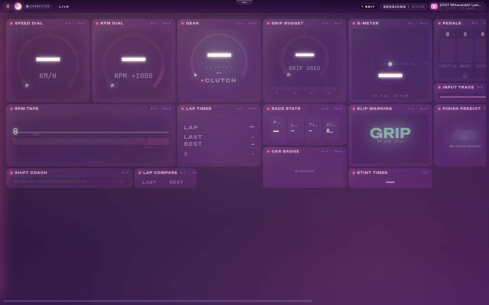

# Aurora Drive

Local-first telemetry dashboard for **Forza Horizon 6**. Listens to the
in-game UDP stream, persists every frame losslessly into TimescaleDB,
derives physics + ML signals on top, and renders the whole thing through
a 40-widget React dashboard with replay, custom layouts, and an optional
local AI co-driver.

Single driver, single machine — no cloud, no accounts, nothing leaves
your LAN.




---

## Features

**Capture & storage**
- 60 Hz UDP decoder for FH6's 324-byte sled-format packet
- Lossless capture into TimescaleDB hypertables — every source-rate frame
  preserved, queryable for replay and analytics
- Continuous aggregates at 10 Hz / 30 Hz for cheap downsampled reads

**Physics & ML**
- Derived signals at frame rate: balance, grip-budget, body-control,
  weight transfer, throttle smoothness, power-band occupancy
- Tire-wear model with calibrated confidence to fill the gap FH6 doesn't
  ship
- Shift-point prediction (per-gear, per-fingerprint) and rewind detection
- Crash-risk estimation, finish-position prediction, best-achievable-lap
  envelopes

**AI co-driver** *(optional)*
- Local `claude` CLI streams one-sentence callouts over a dedicated
  WebSocket — "lift earlier into 5", "smashable on your right". No API
  keys, no remote calls, gracefully disabled if the binary isn't present.

**Dashboard**
- ~40 widgets across live telemetry, predictions, driver analytics, and
  track maps: speed/RPM dials, pedals, steering, G-meter, tire heatmap +
  slip + wear + failure, grip budget, suspension viz, dyno plot, power
  flow, engine cutaway, world map with racing-line trail, lap timer +
  table + compare + predictor, shift coach + report, driver fingerprint,
  style drift, session summary, highlight reel, and more
- Drag/drop layout editor on a 12-column grid, with size presets,
  per-widget settings, and user-defined tabs persisted to localStorage
- Calibrated Leaflet track map over an offline tile pyramid;
  heatmap-coloured racing-line trail
- Full **session replay** — scrub any recorded session; widgets play
  recorded frames transparently via a frame-override layer (no per-widget
  changes)

**Multi-worker ready**
- WebSocket fanout via Redis pub/sub when `FH6_REDIS_URL` is set; falls
  back to an in-process broker for single-worker dev/test

---

## Architecture

```
                  Forza Horizon 6
                        │ UDP :5302
                        ▼
   ┌─────────────────── backend (apps/backend) ───────────────────┐
   │                                                              │
   │  packet decoder ─▶ session manager ─▶ derivations / ML       │
   │         │                  │                  │              │
   │         ▼                  ▼                  ▼              │
   │   hot cache (3 s)    TimescaleDB         predictors          │
   │         │             (hypertables)            │             │
   │         └────────────┬───────────────────┬─────┘             │
   │                      ▼                   ▼                   │
   │              MessageBroker ────▶ /ws/live   /ws/coach        │
   │              (in-proc / Redis)        REST  /api/*           │
   └────────────────────────┬─────────────────────────────────────┘
                            │ nginx (prod) / vite proxy (dev)
                            ▼
              React + TanStack Query dashboard
                    (apps/web/client)
```

---

## Quick start

Requires **Python 3.12** ([uv](https://docs.astral.sh/uv/)),
**Node 20** ([pnpm](https://pnpm.io/) via corepack), and a local
**PostgreSQL 16 + TimescaleDB 2.x**.

```bash
git clone git@github.com:WooFerPPK/aurora-drive.git
cd aurora-drive

# Install backend + web deps
make install

# Bring up Postgres + Redis (skip if you already run them natively)
make db.up

# Create DB + apply migrations (uses the postgres superuser via sudo -u)
make db.test.setup     # first time only
make db.migrate

# Run backend + dashboard in parallel
make dev
```

Then open **http://localhost:5173**.

The backend binds:
- `127.0.0.1:8000` — HTTP + WebSocket
- `0.0.0.0:5302/udp` — telemetry ingress

### In-game setup (FH6)

**Settings → HUD and Gameplay → Data Out**

| Field | Value |
|---|---|
| **Data Out**     | On |
| **IP**           | server LAN IP, or `127.0.0.1` if you play on the same box |
| **Port**         | `5302` |

> Avoid ports `5200–5300` — FH6 reserves that range and the listener will
> refuse to bind there.

---

## Repository layout

```
apps/backend/      FastAPI + SQLAlchemy + TimescaleDB + Redis
apps/web/          Vite + React + TanStack Query + Tailwind dashboard
packages/contract/ Codegen'd TypeScript types from the live OpenAPI + WS schema
infra/compose/     Docker Compose for Postgres + Redis (dev / prod)
scripts/           Lint / format / pre-commit helpers
```

---

## Stack

**Backend** — Python 3.12 · FastAPI · SQLAlchemy 2 (async) · asyncpg ·
Alembic · PostgreSQL 16 + TimescaleDB 2.x · NumPy · SciPy · structlog ·
Redis · pydantic-settings · ruff + mypy strict

**Frontend** — React 18 · TypeScript · Vite 6 · TanStack Query 5 ·
Tailwind 3 · React Router 6 · Leaflet · happy-dom + RTL + vitest

**Build & tooling** — pnpm workspaces · uv · make · pre-commit

---

## Production deploy

```bash
# Backend as a systemd service
sudo cp apps/backend/deploy/fh6-backend.service /etc/systemd/system/
sudo systemctl daemon-reload && sudo systemctl enable --now fh6-backend

# Frontend → nginx webroot
cd apps/web/client && pnpm build
sudo rsync -a --delete dist/ /var/www/aurora-drive/

# nginx vhost — proxy /api and /ws to 127.0.0.1:8000, serve everything
# else from /var/www/aurora-drive. WebSocket needs `proxy_http_version
# 1.1` + `Upgrade`/`Connection` headers.
```

---

## License

Personal project. No license granted; please don't redeploy as a service
or rehost without asking. Code is published for reference, learning, and
contributions back via PR.
